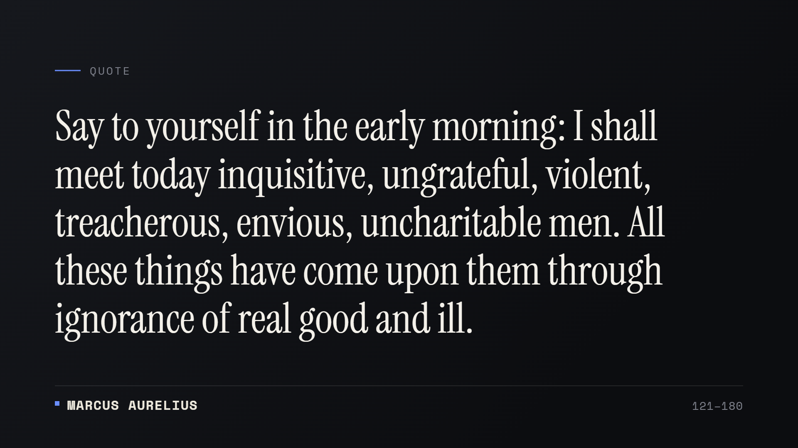
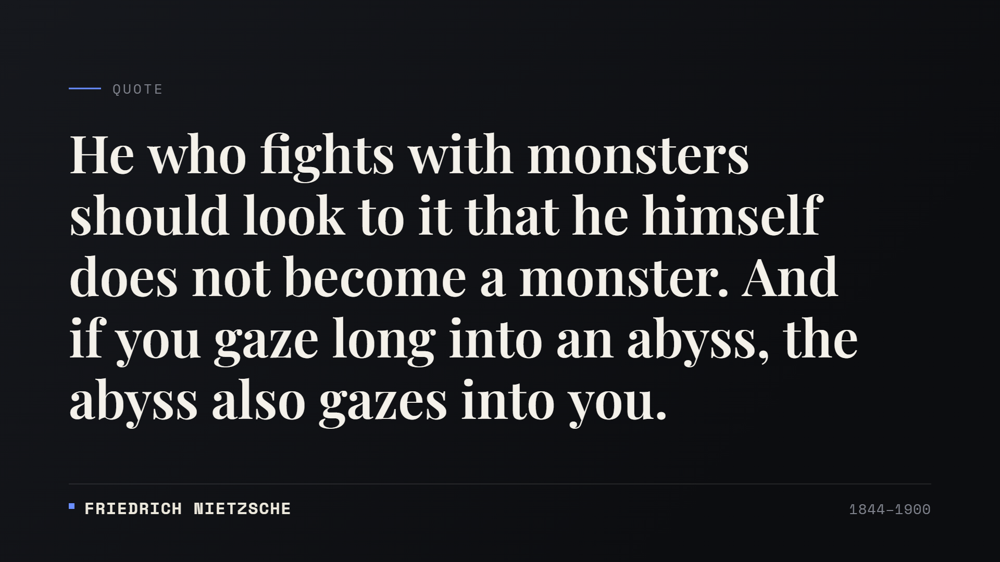
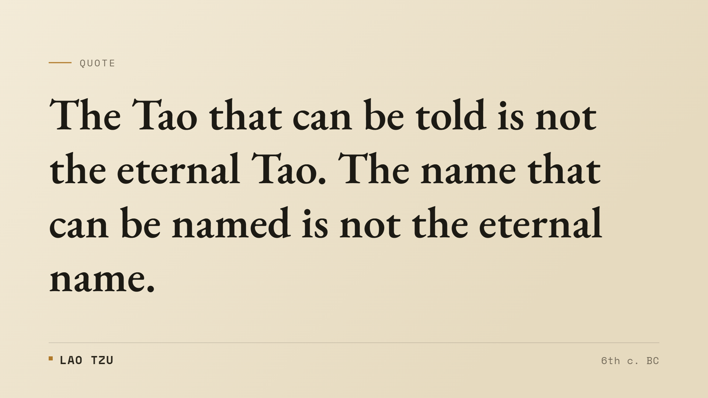

# Words of the wise

<p align="center">
  <strong>Quotes from 30 great thinkers, rendered as cards worth sharing.</strong>
</p>

<p align="center">
  Pick a thinker, pull a quote, and download it as a clean 16:9 image. No login, no
  upload, no build step — everything renders in your browser on an HTML canvas.
  English and Russian, with an editorial card you can make your own.
</p>

<p align="center">
  <a href="https://davvikq.github.io/wise/"></a>
  <a href="LICENSE"></a>
  <a href="https://github.com/davvikq/wise/stargazers"></a>
</p>

<p align="center">
  <strong><a href="https://davvikq.github.io/wise/">▶ Open the live site → davvikq.github.io/wise</a></strong><br>
  <sub>It's already hosted — no need to clone or deploy your own copy to use it.</sub>
</p>

<p align="center">
  <a href="https://davvikq.github.io/wise/"></a>
</p>

---

## Why

Most quote sites are one of two things: a plain text list you scroll and forget, or a
low-effort image with a stock-photo background and a font picked at random. Neither is
something you'd actually post.

This is a small attempt at the third thing — a typographic card that treats the quote
like a printed page. The thinker's name is set in monospaced caps, the years sit on the
opposite edge, and the words get room to breathe. You choose the thinker; the card does
the rest and exports at full resolution.

---

## Features

- **30 thinkers, 836 quotes** — from Socrates and Sun Tzu to Nietzsche, Dostoevsky, and Machiavelli.
- **Bilingual** — the whole interface and every quote switch between English and Russian.
- **One-tap export** — download a 1920×1080 PNG, or copy the quote and author as text.
- **Make it yours** — font, size, alignment, background and text colors, and your own handle on the card. Settings persist locally.
- **Three card looks out of the box** — dark, paper, and blue.
- **No build, no dependencies** — plain HTML, CSS, and JavaScript. Fonts load from Google Fonts; everything else is local.
- **Quiet on accessibility** — keyboard focus, reduced-motion support, and AA-contrast text.

---

## Preview

<p align="center">
  
  
  
</p>

<p align="center"><em>Same engine, three traditions of type — switch them in the Customize panel.</em></p>

---

## Run locally

It's a static site, so any local server works:

```bash
python -m http.server 8000
# or
npx serve
```

Then open the printed URL. No install, no toolchain.

---

## Deploy

> **It's already live at [davvikq.github.io/wise](https://davvikq.github.io/wise/).** You only need this section to host your own copy.

There's no build, so deploying is just hosting the files. For GitHub Pages:

1. Push to a repository.
2. **Settings → Pages → Build and deployment → Deploy from a branch**, pick `main` / root.
3. The site is live at `https://<user>.github.io/<repo>/` about a minute later.

The same files drop straight onto Netlify, Vercel, or any static host.

---

## A note on the quotes

Quotes are curated and attributed by hand, with misattributions and "fake-but-popular"
lines deliberately left out. Wording can still vary between editions and translations, so
a given line may not match a specific printing word for word.

---

## License

MIT — use it, fork it, ship it. © 2026 Davvik.
